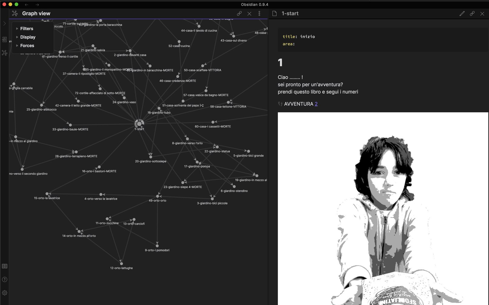

# BuboLibro: Un Regalo Speciale 

la storia completa di questo progretto è qui: [https://stefanocecere.com/project/bubolibro-un-regalo-speciale/](https://stefanocecere.com/project/bubolibro-un-regalo-speciale/)

un libro avventura creato da Fabio (e dal papà Stefano) come regalo per il fratellino di 5 anni.
l'idea è che possa essere poi un regalo che anche altri possano fare ai propri fratellini/sorelline.

## come leggerlo
una preview del libro è online qui: <https://publish.obsidian.md/fabio/>

questo è il progetto base, da cui si esporta il PDF, l'ePub e la versione HTML.
per leggerlo velocemente si può usare Obsidian (un bellissimo e gratuito programma per scrivere e raccogliere note in markdown <https://obsidian.md/> ), andando in preview della pagina 1 dell'avventura [adventure/1-start](adventure/1-start)

## PDF
una versione PDF ridotta è disponibile qui: [BuboLibro_Regalo_web.pdf](_output/BuboLibro_Regalo_web.pdf)

## prodotto
un libro facile da leggere, con pochissimi testi e giusto degli enigmi opzionali (da leggere insieme ad un collaboratore lettore). un disegno a pagina.
diverse pagine di vittoria e altrettante di morte (che riportano indietro)

## caratteristiche
- lettura con i soli numeri
- lettura con i testi aggiunti
- personalizzabile
- minigiochi di percezione, memoria, logica
- colorabile
- creato da un adolescente, con istruzioni online su come ha fatto e come ricrearlo
- open source, in formato cartaceo, PDF ed ebook 

## minigiochi
- colorare alcuni disegni (che sono tutti in B&N)
- in quale pagina si trova tale oggetto?
- quante palle ci sono in giardino?

## tags
per lo sviluppo usiamo questi tags per trovare facilmente i nodi:

**MALUS** : si toglie vita
**BONUS**: si guardagna vita
**INVENTARIO**: si trova un oggetto
**GIOCO** : mini gioco
**AIUTO** : un suggerimento
**TODO_disegno**: manca l'immagine/foto

## emojii
https://gist.github.com/rxaviers/7360908

⬆️⬇️⬅️➡️👀🔍✋👍👎💬♥️⚙️

## copyright
il progetto è di Fabio (12 anni) e in quanto tale ci dispiacerebbe che fosse spudoratamente plagiato. magari se ti interessa contattaci che si collabora!
